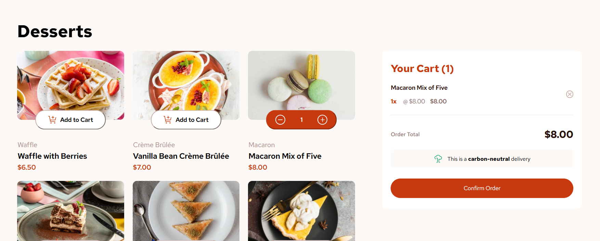

# Frontend Mentor - Product list with cart solution

This is a solution to the [Product list with cart challenge on Frontend Mentor](https://www.frontendmentor.io/challenges/product-list-with-cart-5MmqLVAp_d). Frontend Mentor challenges help you improve your coding skills by building realistic projects. 

## Table of contents

- [Overview](#overview)
  - [The challenge](#the-challenge)
  - [Screenshot](#screenshot)
  - [Links](#links)
- [My process](#my-process)
  - [Built with](#built-with)
  - [What I emphasized on](#what-i-emphasized)
  - [Continued development](#continued-development)
  - [Useful resources](#useful-resources)
  - [AI Collaboration](#ai-collaboration)
- [Author](#author)
- [Acknowledgments](#acknowledgments)

## Overview

This challenge involved updating multiple UI elements and performing calculations using DOM manipulation.

### The challenge

Users should be able to:

- Add items to the cart and remove them
- Increase/decrease the number of items in the cart
- See an order confirmation modal when they click "Confirm Order"
- Reset their selections when they click "Start New Order"
- View the optimal layout for the interface depending on their device's screen size
- Apply UI states for all interactive elements on the page

### Screenshot

### Links

- Live Site URL: [Add live site URL here](https://justzaid.github.io/Frontend-Mentor-Product-List-With-Cart/)

## My process

### Built with

- Mobile-first workflow
- HTML - CSS - JS
- Flexbox
- DOM manipulation

### What I emphasized

- Using a single source-of-truth - When I first started out, most of the data I used to update the UI relied on variables that constantly changed. Those same variables held data that would then require other elements to rely on them. This caused issues when updating individual buttons, updating cart items, cart total value, etc. Creating an object that was used as a single source of truth and dynamically applying all necessary calculations on it made things 10x easier.

### Continued development

This challenge reminded me of React's `useState` hook. Where state lives in one place, and the UI being derived from it. So expanding on this kind of challenge through React will be fun practice. 

### Useful resources

- [MDN](https://developer.mozilla.org/en-US/) - The official documentation website for web technologies was a great resource in freshening up some JavaScript knowledge. `Object.keys()` and `Object.values()` were especially useful in helping me complete this challenge.

- [W3schools](https://www.example.com) - A useful website that helped me test and use a bunch of CSS styling properties.

### AI Collaboration

ChatGPT - I learned that `.fetch()` allows accessing local files in Live server. Since `data.json` was separate from `app.js`, I used `.fetch()` to retrieve and parse it as a JSON object, just like fetching from an external API.

## Author

- Frontend Mentor - [@justzaid](https://www.frontendmentor.io/profile/justzaid)
